# Cosplay商城系统 - 完整架构图集

> 文档版本：v1.0  
> 更新日期：2026-04-15  
> 系统版本：v3.0（Vue 3重构完成）

---

## 📋 目录

1. [系统架构图](#一系统架构图)
2. [数据库ER图](#二数据库er图)
3. [部署架构图](#三部署架构图)
4. [功能模块图](#四功能模块图)

---

## 一、系统架构图

### 1.1 整体架构概览

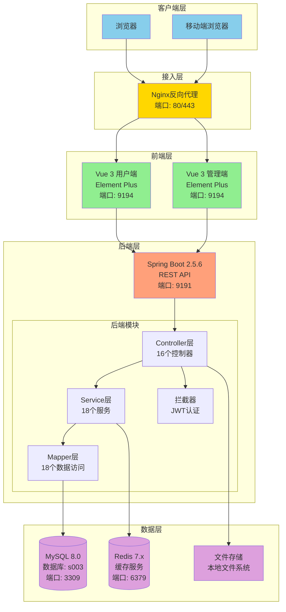

### 1.2 技术栈架构

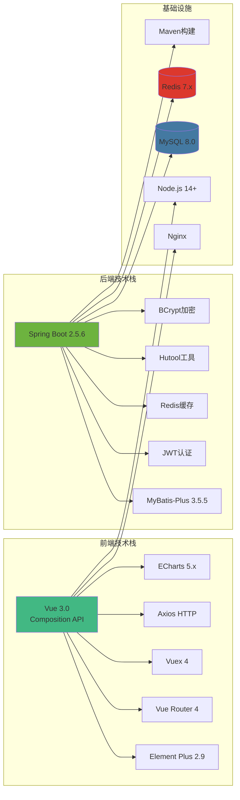

### 1.3 数据流架构

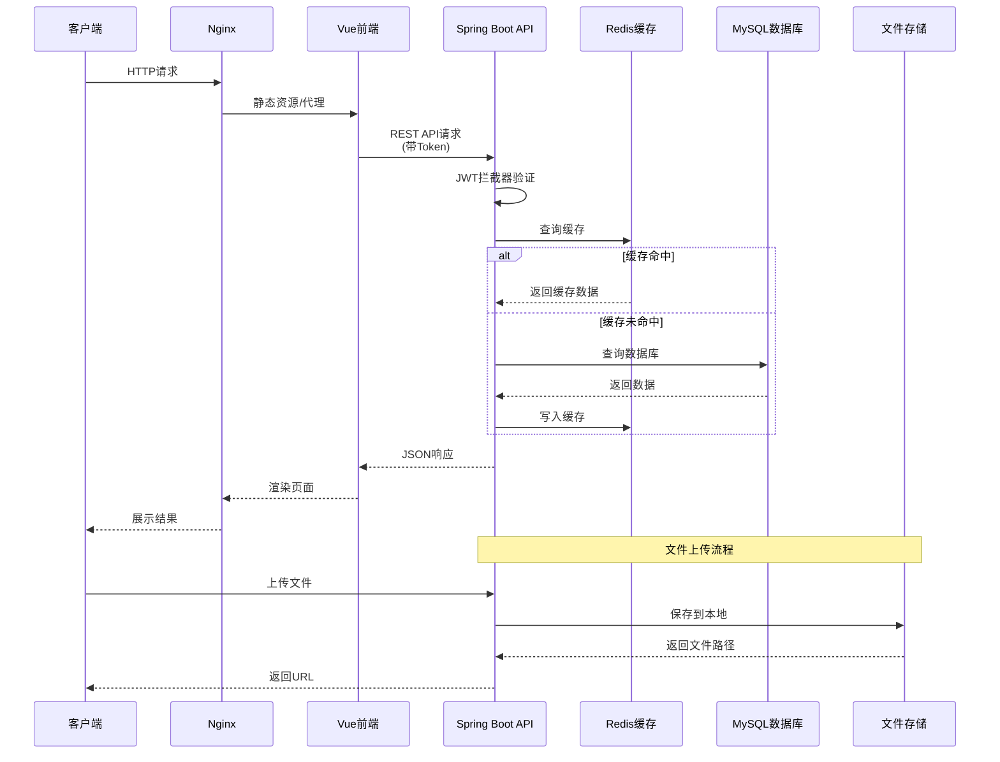

---

## 二、数据库ER图

### 2.1 核心实体关系图

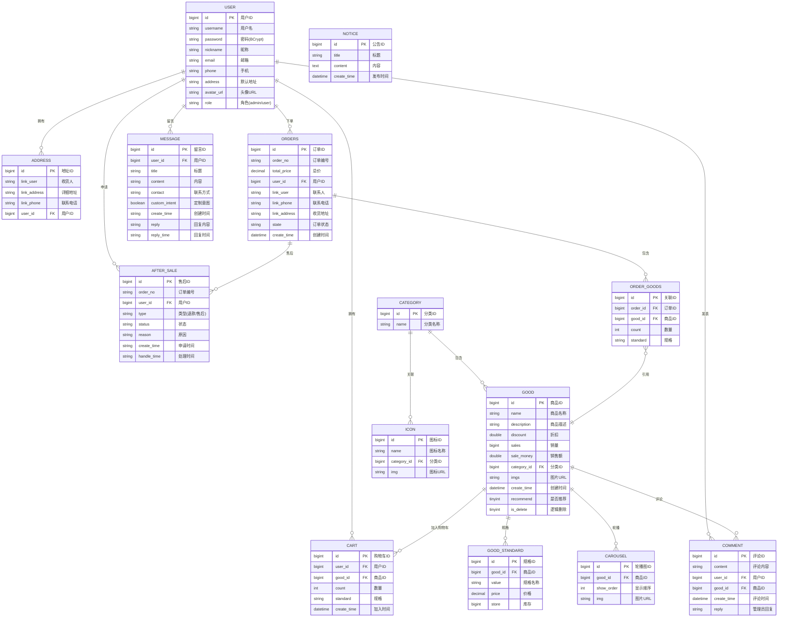

### 2.2 数据库表统计

| 序号 | 表名 | 中文名 | 记录类型 | 关键字段数 |
|------|------|--------|---------|-----------|
| 1 | user | 用户表 | 核心表 | 9 |
| 2 | address | 地址表 | 业务表 | 4 |
| 3 | category | 分类表 | 配置表 | 2 |
| 4 | good | 商品表 | 核心表 | 11 |
| 5 | good_standard | 商品规格表 | 业务表 | 5 |
| 6 | cart | 购物车表 | 业务表 | 6 |
| 7 | orders | 订单表 | 核心表 | 10 |
| 8 | order_goods | 订单商品关联表 | 关联表 | 5 |
| 9 | comment | 评论表 | 业务表 | 6 |
| 10 | message | 留言表 | 业务表 | 9 |
| 11 | after_sale | 售后表 | 业务表 | 7 |
| 12 | carousel | 轮播图表 | 配置表 | 4 |
| 13 | notice | 公告表 | 配置表 | 4 |
| 14 | icon | 图标表 | 配置表 | 4 |
| 15 | sys_file | 文件表 | 系统表 | 6 |
| 16 | avatar | 头像表 | 系统表 | 5 |
| 17 | income | 收入统计表 | 统计表 | 5 |
| 18 | role | 角色表 | 系统表 | 3 |

**总计**：18张表，包含核心表4张、业务表8张、配置表4张、系统表2张

### 2.3 数据表关系说明

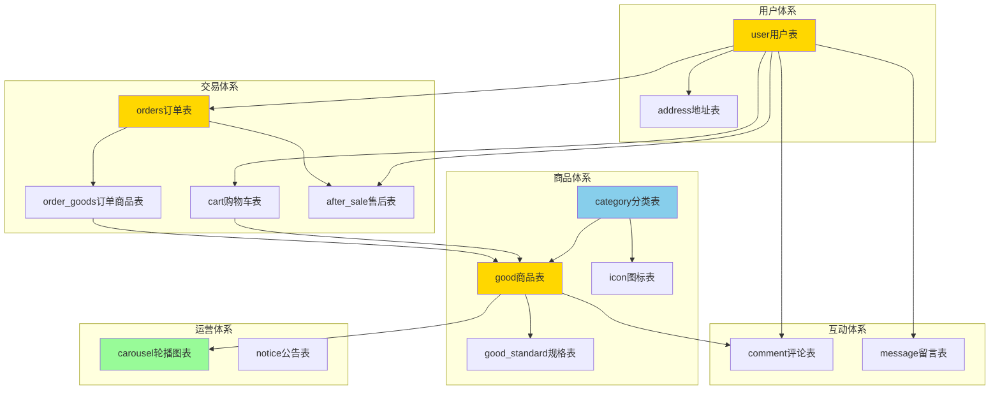

---

## 三、部署架构图

### 3.1 生产环境部署架构

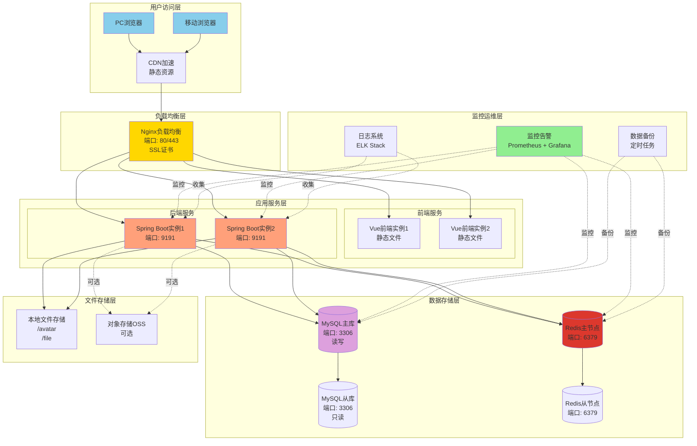

### 3.2 开发环境部署架构

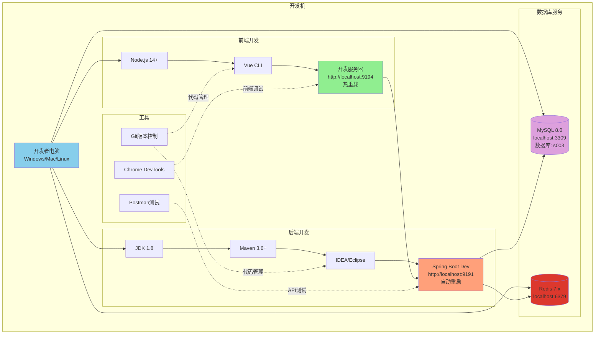

### 3.3 Docker容器化部署（推荐）

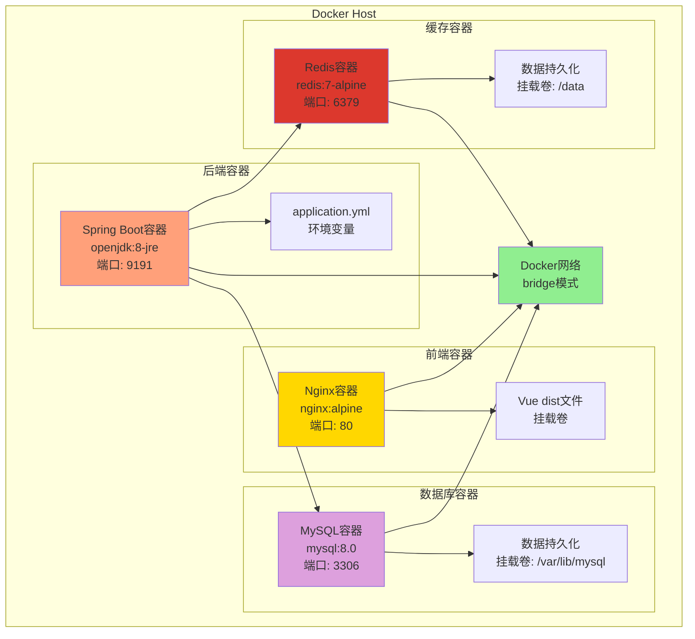

### 3.4 Nginx配置示例

```nginx
# nginx.conf
server {
    listen 80;
    server_name yourdomain.com;
    
    # HTTPS重定向
    return 301 https://$server_name$request_uri;
}

server {
    listen 443 ssl http2;
    server_name yourdomain.com;
    
    # SSL证书
    ssl_certificate /etc/nginx/ssl/cert.pem;
    ssl_certificate_key /etc/nginx/ssl/key.pem;
    
    # 前端静态资源
    location / {
        root /usr/share/nginx/html;
        try_files $uri $uri/ /index.html;
        
        # 静态资源缓存
        location ~* \.(jpg|jpeg|png|gif|ico|css|js)$ {
            expires 30d;
            add_header Cache-Control "public, immutable";
        }
    }
    
    # 后端API代理
    location /api {
        proxy_pass http://localhost:9191;
        proxy_set_header Host $host;
        proxy_set_header X-Real-IP $remote_addr;
        proxy_set_header X-Forwarded-For $proxy_add_x_forwarded_for;
        proxy_set_header X-Forwarded-Proto $scheme;
        
        # 超时设置
        proxy_connect_timeout 60s;
        proxy_read_timeout 120s;
        proxy_send_timeout 60s;
    }
    
    # 文件上传大小限制
    client_max_body_size 30M;
    
    # Gzip压缩
    gzip on;
    gzip_types text/plain application/json application/javascript text/css;
    gzip_min_length 1024;
}
```

### 3.5 Docker Compose配置

```yaml
# docker-compose.yml
version: '3.8'

services:
  # MySQL数据库
  mysql:
    image: mysql:8.0
    container_name: cosplay-mall-mysql
    environment:
      MYSQL_ROOT_PASSWORD: 123456
      MYSQL_DATABASE: s003
      TZ: Asia/Shanghai
    ports:
      - "3306:3306"
    volumes:
      - mysql-data:/var/lib/mysql
      - ./sql/s003.sql:/docker-entrypoint-initdb.d/init.sql
    command:
      --character-set-server=utf8mb4
      --collation-server=utf8mb4_unicode_ci
      --default-time-zone=+08:00
    networks:
      - mall-network
    restart: always

  # Redis缓存
  redis:
    image: redis:7-alpine
    container_name: cosplay-mall-redis
    ports:
      - "6379:6379"
    volumes:
      - redis-data:/data
    networks:
      - mall-network
    restart: always

  # 后端服务
  backend:
    build: ./mall-server
    container_name: cosplay-mall-backend
    environment:
      DB_HOST: mysql
      DB_PORT: 3306
      DB_NAME: s003
      DB_USER: root
      DB_PASS: 123456
      REDIS_HOST: redis
      REDIS_PORT: 6379
      JWT_SECRET: your-secret-key-here
    ports:
      - "9191:9191"
    depends_on:
      - mysql
      - redis
    networks:
      - mall-network
    restart: always

  # 前端服务
  frontend:
    build: ./mall-web
    container_name: cosplay-mall-frontend
    ports:
      - "80:80"
    depends_on:
      - backend
    networks:
      - mall-network
    restart: always

volumes:
  mysql-data:
  redis-data:

networks:
  mall-network:
    driver: bridge
```

---

## 四、功能模块图

### 4.1 系统功能模块总览

```mermaid
graph TB
    subgraph Cosplay商城系统
        subgraph 用户端模块
            U1[首页模块]
            U2[商品模块]
            U3[购物车模块]
            U4[订单模块]
            U5[用户中心]
            U6[互动模块]
        end
        
        subgraph 管理端模块
            M1[数据统计]
            M2[商品管理]
            M3[订单管理]
            M4[用户管理]
            M5[运营管理]
            M6[系统管理]
        end
    end
    
    U1 --> U1_1[轮播图展示]
    U1 --> U1_2[推荐商品]
    U1 --> U1_3[热门分类]
    U1 --> U1_4[公告展示]
    
    U2 --> U2_1[商品列表]
    U2 --> U2_2[商品搜索]
    U2 --> U2_3[商品详情]
    U2 --> U2_4[商品评论]
    U2 --> U2_5[个性化推荐]
    
    U3 --> U3_1[添加商品]
    U3 --> U3_2[修改数量]
    U3 --> U3_3[删除商品]
    U3 --> U3_4[清空购物车]
    U3 --> U3_5[选择结算]
    
    U4 --> U4_1[创建订单]
    U4 --> U4_2[选择地址]
    U4 --> U4_3[支付订单]
    U4 --> U4_4[订单列表]
    U4 --> U4_5[订单详情]
    U4 --> U4_6[确认收货]
    U4 --> U4_7[售后申请]
    
    U5 --> U5_1[个人信息]
    U5 --> U5_2[地址管理]
    U5 --> U5_3[我的订单]
    U5 --> U5_4[我的收藏]
    U5 --> U5_5[我的留言]
    U5 --> U5_6[售后记录]
    
    U6 --> U6_1[商品评论]
    U6 --> U6_2[在线留言]
    U6 --> U6_3[定制咨询]
    
    M1 --> M1_1[收入图表]
    M1 --> M1_2[周收入统计]
    M1 --> M1_3[月收入统计]
    M1 --> M1_4[商品排行]
    M1 --> M1_5[用户统计]
    
    M2 --> M2_1[商品列表]
    M2 --> M2_2[新增商品]
    M2 --> M2_3[编辑商品]
    M2 --> M2_4[删除商品]
    M2 --> M2_5[分类管理]
    M2 --> M2_6[规格管理]
    M2 --> M2_7[推荐设置]
    M2 --> M2_8[上下架管理]
    
    M3 --> M3_1[订单列表]
    M3 --> M3_2[订单详情]
    M3 --> M3_3[订单发货]
    M3 --> M3_4[订单导出]
    M3 --> M3_5[售后处理]
    
    M4 --> M4_1[用户列表]
    M4 --> M4_2[用户搜索]
    M4 --> M4_3[编辑用户]
    M4 --> M4_4[删除用户]
    M4 --> M4_5[重置密码]
    
    M5 --> M5_1[轮播图管理]
    M5 --> M5_2[公告管理]
    M5 --> M5_3[评论管理]
    M5 --> M5_4[留言回复]
    
    M6 --> M6_1[文件管理]
    M6 --> M6_2[头像管理]
    M6 --> M6_3[管理员信息]
    M6 --> M6_4[权限管理]
    
    style U1 fill:#87CEEB
    style U2 fill:#87CEEB
    style U3 fill:#87CEEB
    style U4 fill:#87CEEB
    style U5 fill:#87CEEB
    style U6 fill:#87CEEB
    style M1 fill:#FFD700
    style M2 fill:#FFD700
    style M3 fill:#FFD700
    style M4 fill:#FFD700
    style M5 fill:#FFD700
    style M6 fill:#FFD700
```

### 4.2 用户端功能架构图

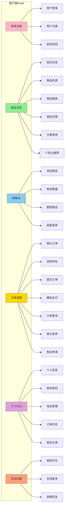

### 4.3 管理端功能架构图

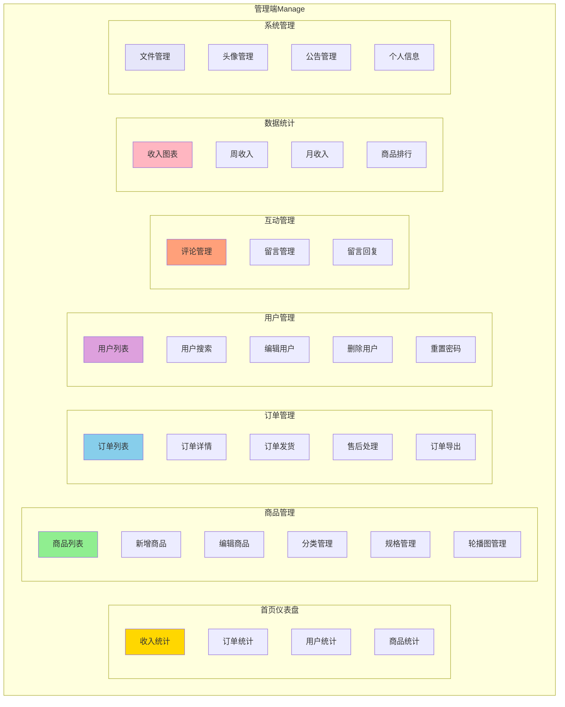

### 4.4 功能模块统计

| 模块类别 | 子模块数 | 功能点数 | 前端页面数 | 后端接口数 |
|---------|---------|---------|-----------|-----------|
| 用户端-首页 | 4 | 8 | 2 | 6 |
| 用户端-商品 | 6 | 15 | 3 | 12 |
| 用户端-购物车 | 5 | 10 | 1 | 6 |
| 用户端-订单 | 7 | 18 | 3 | 10 |
| 用户端-个人中心 | 6 | 12 | 2 | 8 |
| 用户端-互动 | 3 | 6 | 2 | 5 |
| 管理端-数据统计 | 5 | 10 | 2 | 4 |
| 管理端-商品管理 | 8 | 20 | 3 | 15 |
| 管理端-订单管理 | 5 | 12 | 1 | 8 |
| 管理端-用户管理 | 5 | 10 | 1 | 6 |
| 管理端-互动管理 | 3 | 8 | 1 | 5 |
| 管理端-系统管理 | 4 | 8 | 2 | 6 |
| **总计** | **61** | **137** | **23** | **91** |

### 4.5 模块依赖关系

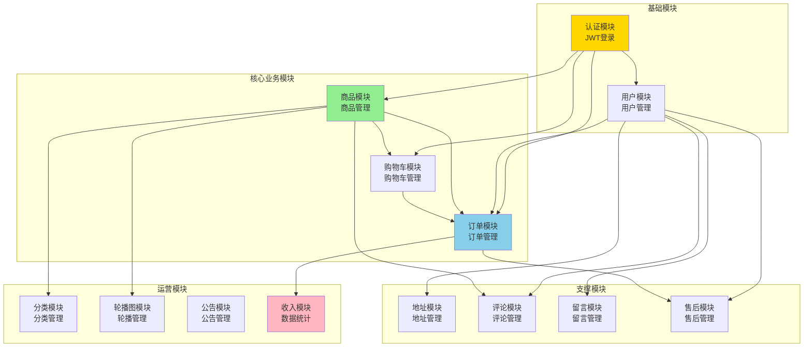

---

## 📊 架构特色总结

### 技术亮点

| 特性 | 实现方式 | 优势 |
|------|---------|------|
| 前后端分离 | Vue 3 + Spring Boot | 独立部署、易于维护 |
| 无状态认证 | JWT Token | 支持水平扩展 |
| 高性能缓存 | Redis缓存 | 响应速度快 |
| 密码安全 | BCrypt加密 | 防彩虹表攻击 |
| 组件化开发 | Vue Composition API | 代码复用性高 |
| 响应式设计 | Element Plus | 适配多端 |
| 个性化推荐 | 协同过滤算法 | 提升用户体验 |
| 自动化部署 | Docker Compose | 一键启动 |

### 架构优势

1. ✅ **高可扩展性** - 微服务友好架构，易于拆分
2. ✅ **高性能** - Redis缓存 + 数据库优化
3. ✅ **高安全性** - 多层安全防护机制
4. ✅ **易维护性** - 清晰的代码分层和文档
5. ✅ **易部署** - Docker容器化部署
6. ✅ **用户体验好** - 个性化推荐 + 响应式设计

---

## 📝 使用说明

### 图表查看

1. **Markdown编辑器** - 直接查看Mermaid图表
2. **在线渲染** - 使用 https://mermaid.live/ 渲染
3. **导出图片** - 右键保存为PNG/SVG
4. **插入文档** - 截图插入PPT/论文

### 文档用途

- 📖 **毕业设计** - 系统架构说明
- 🎓 **项目答辩** - 展示系统设计
- 🔧 **开发参考** - 新人快速了解
- 📊 **项目汇报** - 向导师/领导展示
- 📝 **技术文档** - 团队知识沉淀

---

**文档生成时间**：2026-04-15  
**系统版本**：v3.0（Vue 3 + Spring Boot）  
**维护团队**：开发团队
