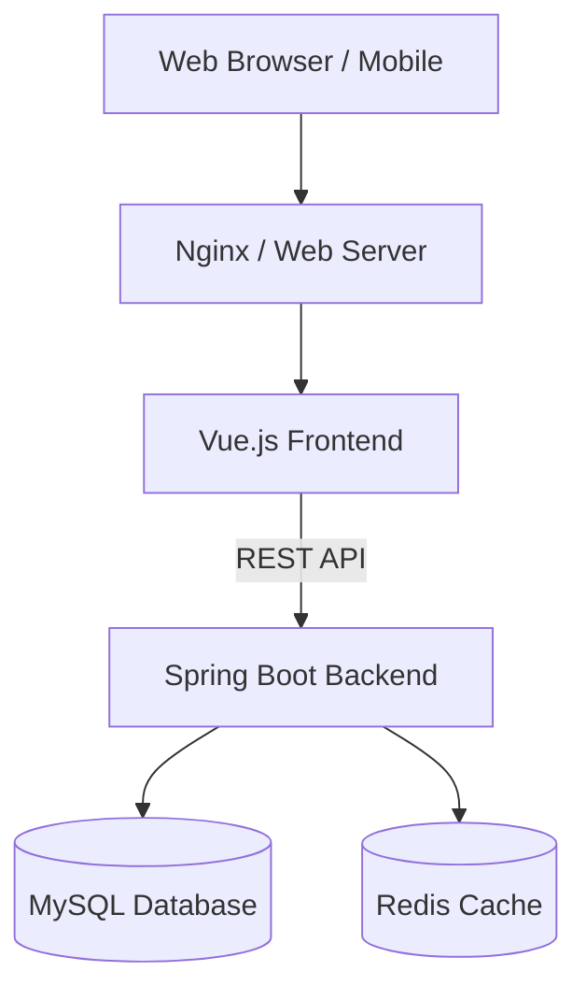

# U次元 - Cosplay服装商城系统文档

## 1. 系统架构

### 1.1 技术栈
*   **前端**: Vue.js 2.x, Element UI, Axios, Vue Router, Vuex
*   **后端**: Spring Boot 2.5.6, MyBatis-Plus, Spring Security (JWT)
*   **数据库**: MySQL 8.0
*   **缓存**: Redis (用于热点数据和Token管理)
*   **工具**: Maven, Hutool, FastJson

### 1.2 架构图

## 2. 模块划分

### 2.1 用户端 (Front)
*   **首页**: 轮播图、推荐商品、热门分类。
*   **商品浏览**: 商品列表、搜索、详情页、规格选择。
*   **购物流程**: 购物车、结算页、支付模拟。
*   **个人中心**: 订单管理（购买）、地址管理、个人信息修改。
*   **互动**: 商品评价、在线留言。

### 2.2 管理端 (Manage)
*   **仪表盘**: 销售统计、流量分析。
*   **商品管理**: 商品增删改查、规格管理、分类管理。
*   **订单管理**: 订单状态流转（发货、收货）、订单导出、售后处理。
*   **用户管理**: 用户列表、权限控制。
*   **运营管理**: 轮播图配置、公告发布、评论管理。

## 3. 核心业务流程

### 3.1 购物流程
1.  用户登录/注册。
2.  浏览商品，选择规格。
3.  点击“购买”或加入购物车。
4.  进入确认订单页，选择收货地址。
5.  提交订单，进行支付。
6.  商家发货。
7.  用户确认收货。
8.  用户评价。

### 3.2 订单状态流转
*   **购买**: 待付款 -> 待发货 -> 已发货 -> 已完成

## 4. 接口文档概览

### 4.1 用户相关
*   `POST /login`: 用户登录
*   `POST /register`: 用户注册
*   `GET /userinfo/{username}`: 获取用户信息

### 4.2 商品相关
*   `GET /api/good/page`: 分页查询商品
*   `GET /api/good/{id}`: 商品详情
*   `GET /api/good/recommend/{userId}`: 个性化推荐

### 4.3 订单相关
*   `POST /api/order`: 创建订单

### 4.4 地址相关
*   `GET /api/address/{userId}`: 获取用户地址列表
*   `POST /api/address`: 新增地址
*   `PUT /api/address`: 修改地址
*   `DELETE /api/address/{id}`: 删除地址

## 5. 部署指南

### 5.1 环境要求
*   JDK 1.8+
*   Node.js 14+
*   MySQL 8.0
*   Redis

### 5.2 后端部署
1.  修改 `application.yml` 中的数据库和Redis配置。
2.  运行 `mvn clean package` 打包。
3.  运行 `java -jar mall-server-0.0.1-SNAPSHOT.jar`。

### 5.3 前端部署
1.  进入 `mall-web` 目录。
2.  运行 `npm install` 安装依赖。
3.  运行 `npm run build` 打包。
4.  将 `dist` 目录部署到 Nginx 或静态服务器。

## 6. 常见问题 (FAQ)

**Q: 为什么上传图片失败？**
A: 请检查 `application.yml` 中的文件存储路径配置，并确保该路径有写入权限。

**Q: 验证码/Token 无效？**
A: 检查 Redis 服务是否正常运行，Token 默认存储在 Redis 中。

**Q: 数据库连接报错？**
A: 确认 MySQL 版本是否兼容（推荐 8.0），并检查连接字符串中的时区设置 `serverTimezone=Asia/Shanghai`。
