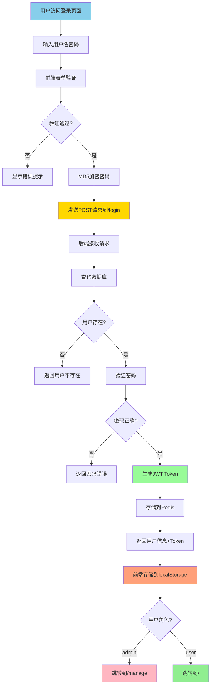
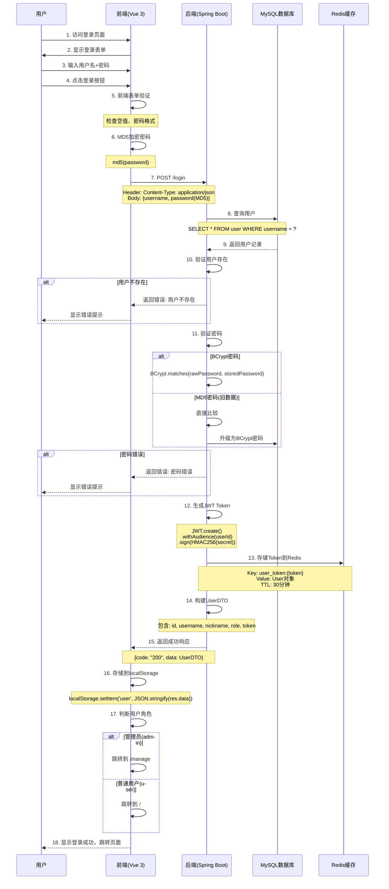
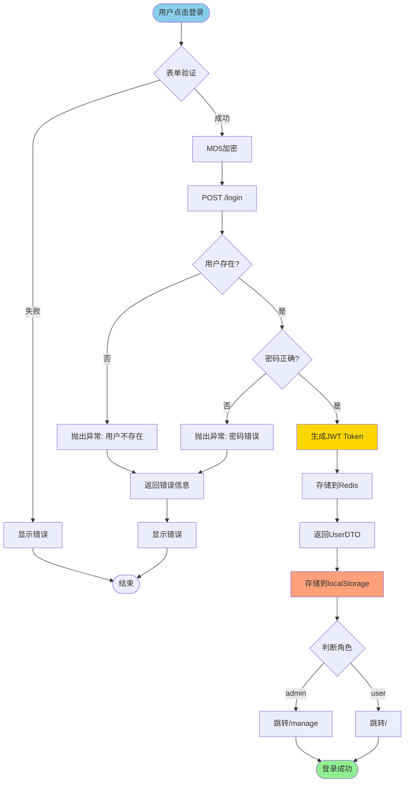

# 用户登录流程 - 完整详解

> 文档版本：v1.0  
> 更新日期：2026-04-15  
> 适用范围：Cosplay商城系统

---

## 📋 目录

1. [登录流程概览](#登录流程概览)
2. [详细流程图](#详细流程图)
3. [前端登录流程](#前端登录流程)
4. [后端登录流程](#后端登录流程)
5. [JWT令牌机制](#jwt令牌机制)
6. [Redis缓存机制](#redis缓存机制)
7. [权限验证流程](#权限验证流程)
8. [密码加密策略](#密码加密策略)
9. [错误处理](#错误处理)
10. [安全机制](#安全机制)
11. [代码实现](#代码实现)

---

## 🎯 登录流程概览



---

## 📊 详细流程图（时序图）



---

## 💻 前端登录流程

### 1. 登录页面组件

```vue
<!-- Login.vue -->
<template>
    <div class="login-box">
        <el-form>
            <el-form-item label="用户名">
                <el-input v-model.trim="user.username"></el-input>
            </el-form-item>
            <el-form-item label="密码">
                <el-input v-model.trim="user.password" show-password></el-input>
            </el-form-item>
            <el-button @click="onSubmit">登录</el-button>
        </el-form>
    </div>
</template>
```

### 2. 前端登录逻辑

```javascript
// 登录处理函数
const onSubmit = () => {
  // 第一步：基础验证
  if (user.value.username === '' || user.value.password === '') {
    ElMessage.error('账号或密码不能为空')
    return
  }
  
  // 第二步：密码格式验证
  const passwordRule = /^(?=.*[A-Za-z])(?=.*\d)(?=.*[!@#$%^&*()_+\-=\[\]{}|;:,.<>?])[A-Za-z\d!@#$%^&*()_+\-=\[\]{}|;:,.<>?]{6,12}$/;
  if (!passwordRule.test(user.value.password)) {
    ElMessage.error('密码必须为6-12位，且同时包含字母、数字和特殊符号')
    return
  }
  
  // 第三步：MD5加密
  let form = {}
  Object.assign(form, user.value)
  form.password = md5(user.value.password)  // 前端MD5加密
  
  // 第四步：发送请求
  request.post('/login', form)
    .then((res) => {
      if (res.code === '200') {
        // 第五步：存储用户信息
        localStorage.setItem('user', JSON.stringify(res.data))
        ElMessage.success('登陆成功')
        
        // 第六步：根据角色跳转
        let redirectPath = to.value
        if (!to.value || to.value === '/') {
          if (res.data.role === 'admin') {
            redirectPath = '/manage'  // 管理员跳转后台
          } else {
            redirectPath = '/'        // 普通用户跳转首页
          }
        }
        router.push(redirectPath)  // 路由跳转，不刷新页面
      } else {
        ElMessage.error(res.msg)
      }
    })
    .catch((e) => {
      // 错误处理
      ElMessage.error('登录失败，请重试')
    })
}
```

### 3. Axios请求封装

```javascript
// utils/request.js
import axios from 'axios'
import router from '@/router'
import { ElMessage } from 'element-plus'

const request = axios.create({
  baseURL: 'http://localhost:9191',
  timeout: 5000
})

// 请求拦截器
request.interceptors.request.use(
  config => {
    // 从localStorage获取用户信息
    const user = localStorage.getItem('user')
    if (user) {
      const userInfo = JSON.parse(user)
      // 添加token到请求头
      config.headers['token'] = userInfo.token
    }
    return config
  },
  error => {
    return Promise.reject(error)
  }
)

// 响应拦截器
request.interceptors.response.use(
  response => {
    return response.data
  },
  error => {
    // 统一错误处理
    if (error.response) {
      const { status } = error.response
      switch (status) {
        case 401:
          ElMessage.error('未授权，请登录')
          localStorage.removeItem('user')
          router.push('/login')
          break
        case 403:
          ElMessage.error('拒绝访问')
          break
        default:
          ElMessage.error(`连接错误 ${status}`)
      }
    }
    return Promise.reject(error)
  }
)

export default request
```

---

## 🔧 后端登录流程

### 1. Controller层

```java
// UserController.java
@PostMapping("/login")
public Result login(@RequestBody LoginForm loginForm) {
    // 调用Service层处理登录逻辑
    UserDTO dto = userService.login(loginForm);
    return Result.success(dto);
}
```

### 2. Service层（核心逻辑）

```java
// UserService.java
public UserDTO login(LoginForm loginForm) {
    // 第一步：根据用户名查询用户
    QueryWrapper<User> queryWrapper = new QueryWrapper<>();
    queryWrapper.eq("username", loginForm.getUsername());
    User user = getOne(queryWrapper);
    
    // 第二步：验证用户是否存在
    if (user == null) {
        throw new ServiceException(Constants.CODE_403, "用户不存在");
    }
    
    // 第三步：验证密码
    String rawPassword = loginForm.getPassword();  // 前端传来的MD5密码
    String storedPassword = user.getPassword();     // 数据库存储的密码
    boolean matched = false;
    
    if (storedPassword.startsWith("$2a$") || storedPassword.startsWith("$2b$")) {
        // BCrypt格式密码（新密码）
        matched = PASSWORD_ENCODER.matches(rawPassword, storedPassword);
    } else {
        // 旧MD5格式密码
        matched = storedPassword.equals(rawPassword);
        if (matched) {
            // 透明升级：将MD5密码迁移为BCrypt
            user.setPassword(PASSWORD_ENCODER.encode(rawPassword));
            this.updateById(user);
        }
    }
    
    // 第四步：密码错误处理
    if (!matched) {
        throw new ServiceException(Constants.CODE_403, "用户名或密码错误");
    }
    
    // 第五步：生成JWT Token
    String token = TokenUtils.genToken(user.getId().toString(), user.getUsername());
    
    // 第六步：存储Token到Redis
    redisTemplate.opsForValue().set(RedisConstants.USER_TOKEN_KEY + token, user);
    redisTemplate.expire(RedisConstants.USER_TOKEN_KEY + token, 
                        RedisConstants.USER_TOKEN_TTL, 
                        TimeUnit.MINUTES);
    
    // 第七步：构建UserDTO返回
    UserDTO userDTO = BeanUtil.copyProperties(user, UserDTO.class);
    userDTO.setToken(token);
    return userDTO;
}
```

---

## 🔐 JWT令牌机制

### 1. Token生成

```java
// TokenUtils.java
public static String genToken(String userId, String username){
    String token = JWT.create()
            .withAudience(userId)  // 将用户ID存入audience字段
            .sign(Algorithm.HMAC256(jwtSecret));  // 使用HMAC256算法签名
    return token;
}
```

### 2. JWT结构

```
JWT = Header.Payload.Signature

Header:
{
  "alg": "HS256",
  "typ": "JWT"
}

Payload:
{
  "aud": "1001",  // 用户ID
  "iat": 1712345678  // 签发时间
}

Signature:
HMACSHA256(
  base64UrlEncode(header) + "." + base64UrlEncode(payload),
  jwtSecret
)
```

### 3. Token示例

```
eyJhbGciOiJIUzI1NiIsInR5cCI6IkpXVCJ9.
eyJhdWQiOiIxMDAxIn0.
K5fZfQ2vYqM8xN3pL7jR9wT1uV6sH4aE8bC2dF0gI3k
```

---

## 💾 Redis缓存机制

### 1. Token存储

```java
// 存储格式
Key:    "user_token:" + token
Value:  User对象（完整用户信息）
TTL:    30分钟（自动续期）
```

### 2. Redis配置

```java
// RedisConfig.java
@Configuration
public class RedisConfig {
    
    @Bean(name = "userRedisTemplate")
    public RedisTemplate<String, User> userRedisTemplate(
            RedisConnectionFactory factory) {
        RedisTemplate<String, User> template = new RedisTemplate<>();
        template.setConnectionFactory(factory);
        
        // 设置序列化方式
        template.setKeySerializer(new StringRedisSerializer());
        template.setValueSerializer(new Jackson2JsonRedisSerializer<>(User.class));
        
        return template;
    }
}
```

### 3. Token续期机制

```java
// JwtInterceptor.java - 每次请求自动续期
redisTemplate.expire(
    RedisConstants.USER_TOKEN_KEY + token, 
    RedisConstants.USER_TOKEN_TTL,  // 30分钟
    TimeUnit.MINUTES
);
```

---

## 🔒 权限验证流程

### 1. JWT拦截器

```java
// JwtInterceptor.java
@Override
public boolean preHandle(HttpServletRequest request, 
                        HttpServletResponse response, 
                        Object handler) {
    // 第一步：获取Token
    String token = request.getHeader("token");
    
    // 第二步：检查是否需要登录
    Authority authority = getAuthorityAnnotation(handler);
    boolean requireLogin = (authority == null) || 
                          (authority.value() != AuthorityType.noRequire);
    
    // 第三步：验证Token存在
    if (!StringUtils.hasLength(token)) {
        if (requireLogin) {
            throw new ServiceException(Constants.TOKEN_ERROR, "token失效,请重新登陆");
        }
        return true;  // 公开接口直接放行
    }
    
    // 第四步：从Redis获取用户信息
    User user = redisTemplate.opsForValue()
                             .get(RedisConstants.USER_TOKEN_KEY + token);
    
    if (user == null) {
        if (requireLogin) {
            throw new ServiceException(Constants.TOKEN_ERROR, "token失效,请重新登陆");
        }
        return true;
    }
    
    // 第五步：存储到ThreadLocal
    UserHolder.saveUser(user);
    
    // 第六步：Token续期
    redisTemplate.expire(RedisConstants.USER_TOKEN_KEY + token, 
                        RedisConstants.USER_TOKEN_TTL, 
                        TimeUnit.MINUTES);
    
    // 第七步：验证JWT签名
    JWTVerifier jwtVerifier = JWT.require(Algorithm.HMAC256(TokenUtils.getJwtSecret()))
                                 .build();
    try {
        jwtVerifier.verify(token);
    } catch (JWTVerificationException e) {
        if (requireLogin) {
            throw new ServiceException(Constants.TOKEN_ERROR, "token验证失败，请重新登陆");
        }
        return true;
    }
    
    return true;  // 验证通过
}

@Override
public void afterCompletion(HttpServletRequest request, 
                           HttpServletResponse response, 
                           Object handler, 
                           Exception ex) {
    // 请求完成后清理ThreadLocal
    UserHolder.removeUser();
}
```

### 2. 权限注解

```java
// 三种权限级别
@Authority(AuthorityType.noRequire)      // 不需要登录
@Authority(AuthorityType.requireLogin)   // 需要登录
@Authority(AuthorityType.requireAuthority) // 需要管理员权限

// 使用示例
@Authority(AuthorityType.requireAuthority)  // 需要管理员
@GetMapping("/user/page")
public Result findPage(...) { }

@Authority(AuthorityType.requireLogin)  // 需要登录
@PostMapping("/api/message")
public Result create(...) { }

// 默认需要登录（未标注noRequire）
@PostMapping("/login")
public Result login(...) { }
```

### 3. 权限验证工具

```java
// TokenUtils.java
public static boolean validateAuthority(){
    try {
        User user = getCurrentUser();
        if (user.getRole().equals("admin")) {
            return true;  // 管理员权限
        }
    } catch (Exception e) {
        return false;
    }
    throw new ServiceException(Constants.CODE_403, "无权限！");
}
```

---

## 🔑 密码加密策略

### 1. 双重加密机制

```
用户输入密码 → 前端MD5加密 → 后端BCrypt加密 → 存储到数据库
```

### 2. 前端MD5加密

```javascript
import md5 from 'js-md5'

// 登录时
form.password = md5(user.value.password)

// 注册时
form.password = md5(user.value.password)
```

### 3. 后端BCrypt加密

```java
// 注册时加密
user.setPassword(PASSWORD_ENCODER.encode(password));

// 登录时验证
boolean matched = PASSWORD_ENCODER.matches(rawPassword, storedPassword);
```

### 4. 密码迁移策略

```java
// 自动将旧MD5密码升级为BCrypt
if (storedPassword.startsWith("$2a$") || storedPassword.startsWith("$2b$")) {
    // BCrypt格式
    matched = PASSWORD_ENCODER.matches(rawPassword, storedPassword);
} else {
    // 旧MD5格式
    matched = storedPassword.equals(rawPassword);
    if (matched) {
        // 透明升级
        user.setPassword(PASSWORD_ENCODER.encode(rawPassword));
        this.updateById(user);
    }
}
```

### 5. 密码格式验证

```java
// 正则表达式：6-12位，包含字母、数字、特殊符号
private static final Pattern PASSWORD_PATTERN = Pattern.compile(
    "^(?=.*[A-Za-z])(?=.*\\d)(?=.*[!@#$%^&*()_+\\-=\\[\\]{}|;:,.<>?])" +
    "[A-Za-z\\d!@#$%^&*()_+\\-=\\[\\]{}|;:,.<>?]{6,12}$"
);

// 验证方法
private void validatePassword(String password) {
    if (password == null || !PASSWORD_PATTERN.matcher(password).matches()) {
        throw new ServiceException("400", 
            "密码必须为6-12位，且同时包含字母、数字和特殊符号");
    }
}
```

---

## ❌ 错误处理

### 1. 前端错误处理

```javascript
// 表单验证错误
if (user.value.username === '' || user.value.password === '') {
    ElMessage.error('账号或密码不能为空')
    return
}

// 密码格式错误
if (!passwordRule.test(user.value.password)) {
    ElMessage.error('密码必须为6-12位，且同时包含字母、数字和特殊符号')
    return
}

// 后端返回错误
if (res.code !== '200') {
    ElMessage.error(res.msg)  // 显示后端错误信息
}

// 网络错误
.catch((e) => {
    if (e.response == undefined) {
        ElMessage.error('网络错误，请检查网络连接')
    } else {
        ElMessage.error(e.response.data)
    }
})
```

### 2. 后端错误处理

```java
// 用户不存在
if (user == null) {
    throw new ServiceException(Constants.CODE_403, "用户不存在");
}

// 密码错误
if (!matched) {
    throw new ServiceException(Constants.CODE_403, "用户名或密码错误");
}

// Token失效
if (!StringUtils.hasLength(token)) {
    throw new ServiceException(Constants.TOKEN_ERROR, "token失效,请重新登陆");
}

// 无权限
throw new ServiceException(Constants.CODE_403, "无权限！");
```

### 3. 错误码定义

```java
// Constants.java
public class Constants {
    public static final String CODE_200 = "200";  // 成功
    public static final String CODE_401 = "401";  // 未授权
    public static final String CODE_403 = "403";  // 禁止访问
    public static final String CODE_500 = "500";  // 服务器错误
    public static final String TOKEN_ERROR = "401";  // Token错误
}
```

---

## 🛡️ 安全机制

### 1. 多层安全防护

```
┌─────────────────────────────────────┐
│         第一层：前端验证              │
│  - 空值检查                          │
│  - 密码格式验证                      │
│  - MD5加密                           │
└─────────────────────────────────────┘
              ↓
┌─────────────────────────────────────┐
│         第二层：JWT拦截器             │
│  - Token存在性检查                   │
│  - Redis缓存验证                     │
│  - JWT签名验证                       │
│  - Token自动续期                     │
└─────────────────────────────────────┘
              ↓
┌─────────────────────────────────────┐
│         第三层：权限注解              │
│  - @Authority注解                    │
│  - 角色验证                          │
│  - 方法级权限控制                    │
└─────────────────────────────────────┘
              ↓
┌─────────────────────────────────────┐
│         第四层：密码加密              │
│  - 前端MD5                           │
│  - 后端BCrypt                        │
│  - 密码迁移机制                      │
└─────────────────────────────────────┘
```

### 2. 防止常见攻击

| 攻击类型 | 防护措施 |
|---------|---------|
| SQL注入 | MyBatis参数化查询 |
| XSS攻击 | 前端输入过滤 |
| CSRF攻击 | JWT Token验证 |
| 暴力破解 | 密码复杂度要求 |
| Token窃取 | HTTPS传输 + Redis存储 |
| 密码泄露 | BCrypt加密存储 |

### 3. Session管理

```java
// ThreadLocal存储用户信息
public class UserHolder {
    private static final ThreadLocal<User> tl = new ThreadLocal<>();
    
    public static void saveUser(User user) {
        tl.set(user);
    }
    
    public static User getUser() {
        return tl.get();
    }
    
    public static void removeUser() {
        tl.remove();  // 请求结束后清理，防止内存泄漏
    }
}
```

---

## 💡 代码实现

### 完整登录流程图



---

## 📊 登录流程数据统计

| 步骤 | 耗时 | 说明 |
|------|------|------|
| 前端验证 | <10ms | 表单校验、MD5加密 |
| 网络传输 | 50-200ms | HTTP请求 |
| 数据库查询 | 10-50ms | 查询用户记录 |
| 密码验证 | 100-300ms | BCrypt验证（故意慢） |
| Token生成 | <5ms | JWT创建 |
| Redis存储 | 5-20ms | 缓存Token |
| **总计** | **165-585ms** | 正常情况 |

---

## 🔍 调试技巧

### 1. 前端调试

```javascript
// 查看发送的请求
console.log('登录请求:', form)

// 查看响应
console.log('登录响应:', res)

// 查看localStorage
console.log('用户信息:', localStorage.getItem('user'))
```

### 2. 后端调试

```java
// 打印登录信息
log.info("用户登录: {}", loginForm.getUsername());
log.info("Token生成: {}", token);

// Redis查看
redis-cli
> KEYS user_token:*
> GET user_token:eyJhbGciOi...
> TTL user_token:eyJhbGci...
```

### 3. 数据库调试

```sql
-- 查看用户信息
SELECT id, username, password, role FROM user WHERE username = 'test';

-- 查看密码格式（BCrypt以$2a$或$2b$开头）
SELECT LEFT(password, 10) FROM user;
```

---

## 📝 总结

### 登录流程核心要点

1. ✅ **双重加密**：前端MD5 + 后端BCrypt
2. ✅ **JWT认证**：无状态、可扩展
3. ✅ **Redis缓存**：高性能Token管理
4. ✅ **自动续期**：活跃用户永不过期
5. ✅ **权限分级**：三级权限控制
6. ✅ **密码迁移**：MD5自动升级BCrypt
7. ✅ **安全防护**：多层安全机制

### 技术亮点

- 🚀 **高性能**：Redis缓存 + JWT无状态
- 🔒 **高安全**：BCrypt加密 + 多层验证
- 🔄 **可扩展**：JWT支持分布式部署
- 📦 **易维护**：清晰的代码分层
- 🎯 **用户体验**：自动续期 + 角色路由

---

**文档更新时间**：2026-04-15  
**系统版本**：v3.0（Vue 3 + Spring Boot）  
**维护人员**：开发团队
